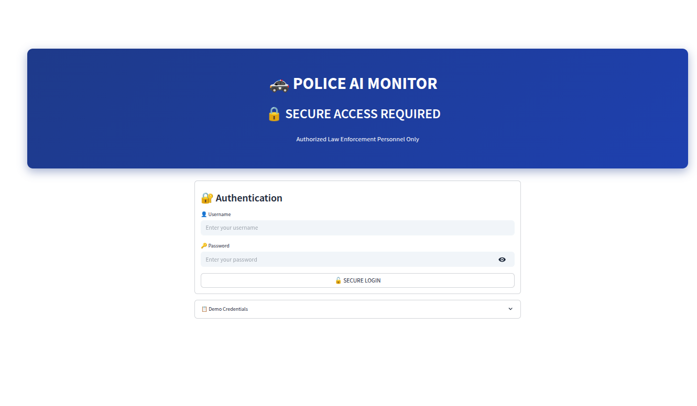

# Police AI Monitor

A social media monitoring and intelligence platform for law enforcement agencies. This application helps monitor social media platforms for potential threats and provides analytical tools for law enforcement operations.

## Getting Started

To run the application locally:

```bash
# Install dependencies
pip install -r requirements.txt

# Run the application
python run.py
```

The application will be available at `http://localhost:8501`

Alternatively, you can run it directly with:
```bash
streamlit run src/main.py
```

## What It Does

This tool helps law enforcement agencies by:

- **Social Media Monitoring**: Tracks posts across multiple platforms
- **Threat Detection**: Uses AI to identify potential security threats
- **Real-time Alerts**: Notifies users when suspicious activity is detected
- **Data Analysis**: Provides charts and insights from collected data
- **Evidence Management**: Helps organize and export evidence for legal purposes

## Main Features

- **Dashboard**: Overview of all monitoring activities
- **Live Feed**: Real-time social media posts
- **Alert System**: Automated threat notifications
- **Analytics**: Charts and data visualization
- **NLP Analysis**: Text analysis for sentiment and threat detection
- **Database Management**: Store and manage collected data
- **Web Scraping**: Collect data from various social platforms

## Project Structure

```
police-ai-monitor/
├── src/                    # Source code
│   ├── main.py            # Main application
│   ├── pages/             # Different app pages
│   ├── services/          # External API integrations
│   └── utils/             # Helper functions
├── config/                # Configuration files
├── data/                  # Database files
├── docs/                  # Documentation
└── requirements.txt       # Python dependencies
```

## Technology Used

- **Python**: Main programming language
- **Streamlit**: Web application framework
- **SQLite**: Database for storing data
- **NLTK/spaCy**: Natural language processing
- **Plotly**: Data visualization
- **Pandas**: Data manipulation

## Screenshots

### Login & Authentication

Secure authentication system requiring authorized law enforcement personnel credentials. Features professional police-themed design with proper security protocols and access control for authorized personnel only.

### Main Dashboard

Comprehensive overview of all monitoring activities including system metrics, active alerts, intelligence reports, and system health indicators. The dashboard provides quick action buttons for rapid access to key functions and real-time system status.

### Real-Time Intelligence Feed

Live monitoring interface showing social media posts with sentiment analysis, engagement metrics, and threat classification. The system tracks multiple platforms simultaneously and provides detailed analytics for each monitored post.

### Alert Management System

Advanced alert management showing active threats, alert trends over time, and critical notifications. The system provides real-time monitoring with customizable alert thresholds and automated response coordination tools.

### API Management Center

Comprehensive API configuration interface for managing external service connections. Features secure token management for social media platforms with encryption enabled and session-only storage for maximum security.


Advanced API setup and configuration options for multiple social media platforms including Twitter/X, Facebook, Telegram, Reddit, and YouTube with comprehensive connection testing and validation.

### Advanced NLP Analysis Engine

Advanced Natural Language Processing engine with multi-language support, threat detection, and risk assessment capabilities. Provides AI-powered content analysis for threat detection and intelligence gathering with comprehensive analysis controls.

### Data Visualization & Analytics

Real-time threat assessment dashboard featuring interactive charts, threat level gauges, and comprehensive monitoring metrics designed specifically for law enforcement operations.


Geographic threat analysis with interactive mapping showing threat distribution, platform-specific analytics, and keyword frequency analysis for enhanced situational awareness.


Advanced network analysis displaying account relationships, connection patterns, and bot detection algorithms to identify suspicious account clusters and coordinated threat activities.


Comprehensive trend analysis showing threat activity patterns over time, content volume analysis, and predictive modeling for proactive threat prevention and response planning.

### Live Twitter Monitoring

Real-time Twitter/X monitoring system with live stream processing, keyword tracking, and automated threat detection for immediate response to emerging security concerns.


Advanced Twitter analytics dashboard showing engagement metrics, sentiment analysis, viral content tracking, and comprehensive social media intelligence gathering capabilities.

### Database Management

Comprehensive database management interface for storing, organizing, and retrieving intelligence data with secure backup systems, data export capabilities, and forensic-ready evidence preservation.

### Evidence Management System

Professional evidence collection and management system designed for legal compliance, featuring digital signatures, chain of custody tracking, and court-ready evidence package generation.

### Fallback System

Robust fallback system ensuring continuous operation even during API outages or network issues, featuring cached data access, offline capabilities, and graceful degradation protocols.


Advanced fallback system features including data redundancy, automatic failover, cached intelligence feeds, and seamless transition between online and offline operational modes.

### Web Scraper

Advanced web scraping engine for intelligence gathering from various online sources including news sites, forums, and social media platforms with configurable extraction rules and data validation.

### Workflow Optimizer

Intelligent workflow optimization system for streamlining law enforcement operations, featuring automated task management, resource allocation, and operational efficiency monitoring.

### Custom Deployment Features

Flexible deployment options supporting various infrastructure configurations, cloud platforms, and on-premises installations with scalable architecture and security compliance.


Advanced network deployment configurations for distributed law enforcement operations, supporting multi-location setups, secure communications, and centralized command and control.

## Demo Mode

The application includes demo data and simulated social media posts for testing purposes. You can use the demo mode to explore features without connecting to real social media APIs.

## Deployment

You can deploy this application to:

- **Streamlit Cloud**: Upload to GitHub and deploy via share.streamlit.io
- **Heroku**: Use the included Procfile
- **Docker**: Use the included Dockerfile

## Security Note

This application is designed for legitimate law enforcement use only. It includes security features like authentication and audit logging. Always ensure compliance with local laws and regulations when using social media monitoring tools.

## License

MIT License
